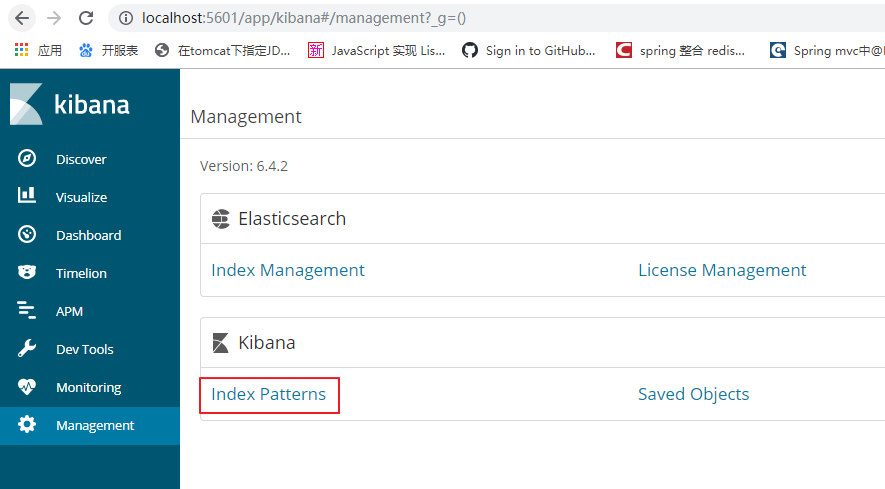

## elasticsearch 学习笔记

### 一、安装并配置JDK环境变量

> 要求：jdk1.8以上

### 二、安装ElasticSearch6.4.2

#### 2.1、下载或者直接使用本教程安装包下的安装文件elasticsearch-6.4.2.tar.gz


#### 2.2、将下载的zip包移动到/usr/local并解压

```shell
tar -zxvf elasticsearch-6.4.2.tar.gz
```


#### 2.3、创建启动用户

> elasticsearch 不能直接使用root用户启动，所以新建用户并授权用于管理elasticsearch 服务

```shell
#创建用户组
groupadd esgroup 
#创建用户并设置密码
useradd esuser -g esgroup -p espassword
#给esuser用户授权
chown -R esuser:esgroup /usr/local/elasticsearch-6.4.2
#切换用户
su esuser
```

#### 2.4、调整jvm内存大小

避免由于内存太小导致的elasticsearch 服务启动失败，根据服务器或者虚拟机实际内存大小调整jvm内存

```shell
cd /usr/local/elasticsearch-6.4.2/bin
vim elasticsearch
#修改
ES_JAVA_OPTS="-Xms512m -Xmx512m"
```


#### 2.5、编辑/etc/security/limits.conf

```shell
vim /etc/security/limits.conf 
#增加
esuser soft nofile 65536
esuser hard nofile 65536
esuser soft nproc 4096
esuser hard nproc 4096
```


#### 2.6、编辑/etc/security/limits.d/20-nproc.conf

```shell
vim /etc/security/limits.d/20-nproc.conf 
#修改为 
esuser soft nproc 4096
```


#### 2.7、编辑/etc/sysctl.conf

```shell
vim /etc/sysctl.conf
#增加
vm.max_map_count=655360
#使生效
sysctl -p
```


#### 2.8、配置远程访问

```shell
config/elasticsearch.yml
#集群名称
cluster.name: my-application
#远程访问IP 服务器的IP地址
network.host: 192.168.253.130
#远程访问端口
http.port: 9200
```


#### 2.9、启动elasticsearch服务

```shell
cd /usr/local/elasticsearch-6.4.2/bin
#1.直接启动
 ./elasticsearch
#2.后台启动
./elasticsearch -d
#后台启动如果报错，可能需要授权
chmod +x bin/elasticsearch
```

#### 2.10、测试elasticsearch服务

```shell
curl 192.168.253.130:9200
```


### 三、安装中文分词器-IK分词器

> 使用本教程安装包下的安装文件《elasticsearch-analysis-ik-6.4.2.zip》
>
> 或者下载安装包：https://github.com/medcl/elasticsearch-analysis-ik/releases/download/v6.4.2/elasticsearch-analysis-ik-6.4.2.zip

#### 3.1、创建插件目录

> 在/usr/local/elasticsearch-6.4.2/plugins目录下新建ik目录

#### 3.2、将下载好的安装包解压到/usr/local/elasticsearch-6.4.2/plugins/ik

```shell
unzip elasticsearch-analysis-ik-6.4.2.zip
```


#### 3.3、重启es，测试中文分词器


### 四、安装Kibana客户端

[Kibana 官方中文用户手册](https://www.elastic.co/guide/cn/kibana/current/index.html)

#### 4.1、下载并解压安装包《kibana-6.4.2-windows-x86_64.zip》

#### 4.2、修改配置文件

> 配置elasticsearch地址


#### 4.3、启动Kibana


#### 4.4、测试访问

```shell
http://localhost:5601
```

### 五、ES使用

[Elasticsearch官方中文使用指南](https://www.elastic.co/guide/cn/elasticsearch/guide/current/index.html)

#### 5.1、ES支持的数据类型

- text 文本类型，text类型如果不显示指定映射的字段属性，默认是使用标准分词器进行分词，一般数据类型是text要么显示指定分词器，要么不分词，一般不使用默认的分词器（除非文本是纯英文）
- keyword : 如果数组中的值是字符串，最好使用keyword, 它不会对字符串进行分词
- date 支持的格式有：可以通过format定义日期的数据格式，也支持毫秒数
- boolean
- float
- double
- byte
- short
- integer
- long
- object
- nested : 嵌套对象, 用于数组中的元素是对象的[{}, {}]
- ip 即支持ipv4也支持ipv6
- completion
- binary
- geo-point： 支持经纬度存储和距离范围检索
- geo-shape：支持任意图形范围的检索，例如矩形和平面多边形

#### 5.2、映射mappings

映射就是创建索引时指定都包含哪些字段以及字段的数据类型、分词器等一些设置。

字段设置参数

- “type”: “text”, // 指定字段的数据类型

- “analyzer”:”ik _max_word”, //指定分词器的名称,即可用使用内置的分词器也可以使用第三方分词器

  - 默认standard，
  - 内置的分析器有whitespace 、 simple和english
  - 第三方分词器：ik分词器 包括ik_max_word和ik_smart，ik_max_word：会将文本做最细粒度的拆分；尽可能多的拆分出词语 ，ik_smart：会做最粗粒度的拆分；已被分出的词语将不会再次被其它词语占有

- “search_analyzer”:”ik _max_word” // 指定查询的分词器,默认和analyzer保持一致，一般分词器和查询分词器要保持一致

- “properties”: {}, // 当数据类型是object时，需要具体指定内部对象对应的字段

- “format”: “yyy-MM-dd HH:mm:ss||yyyy-MM-dd||epoch_millis” // 格式化，一般用于指定日期类型的格式

- “dynamic”: “strict” 动态映射配置，当文档中发现新字段时应该如何处理, 可以用在根 object 或任何 object 类型的字段上，你可以将 dynamic 的默认值设置为 strict , 而只在指定的内部对象中开启它

  - true: 默认值，动态添加新的字段
  - false: 忽略新的字段
  - strict: 如果遇到新字段抛出异常,如果Elasticsearch是作为重要的数据存储，可能就会期望遇到新字段就会抛出异常，这样能及时发现问题。

- dynamic_templates 动态模板：为满足条件的字段做统一映射，可以通过字段名称或者字段类型来匹配指定的映射规则，每个模板都有一个名称，你可以用来描述这个模板的用途， 一个mapping来指定映射应该怎样使用，以及至少一个参数 (如 match) 来定义这个模板适用于哪个字段。

  模板按照顺序来检测；第一个匹配的模板会被启用

  - match 参数只匹配字段名称
  - match_mapping_type 允许你应用模板到特定类型的字段上，就像有标准动态映射规则检测的一样

- “fielddata”:boolean //针对分词字段，参与排序或聚合时能提高性能，默认是false，false是不允许聚合操作的

- “boost”:1.23 // 权重：字段级别的分数加权，指定字段在搜索时所占的权重，所占的百分比

- “fields”:{“raw”:{“type”:”keyword”}} //可以对一个字段提供多种索引模式，同一个字段的值，一个分词，一个不分词，应用场景：即可以用于对字符串进行字符排序，也可以全文索引,排序时使用字段.raw来引用排序字段

- “index”: “analyzed”, // 指定文本类型的字段是否分词、是否存储该字段的值（在新版本中index值为boolean类型，语意也发生了变化，TODO待更新），有三个值：

  - analyzed:首先分析字符串，然后索引(存储)它。换句话说，以全文索引这个域（也就是说即分词，又存储字段的值，即可以通过全文检索的方式对该字段进行搜索）
  - not_analyzed:索引(存储)这个域，所以它能够被搜索，但索引的是精确值。不会对它进行分析(不对字段的值进行分词，而是完整的存储该值，所以只能通过精确值才能搜索出来，即完全匹配，相当于sql中的等号=的作用)
  - no:不索引这个域。这个域不会被搜索到(对该字段不分词，也不存储，相当于没有这个字段一样？？？)

- “store”:false//是否单独设置此字段的是否存储而从_source字段中分离，默认是false，只能搜索，不能获取值

- “doc_values”:false//对not_analyzed字段，默认都是开启，分词字段不能使用，对排序和聚合能提升较大性能，节约内存

- “ignore_above”:100 //超过100个字符的文本，将会被忽略，不被索引

- “include_in_all”:ture//设置是否此字段包含在_all字段中，默认是true，除非index设置成no选项

- “index_options”:”docs”//4个可选参数docs（索引文档号） ,freqs（文档号+词频），positions（文档号+词频+位置，通常用来距离查询），offsets（文档号+词频+位置+偏移量，通常被使用在高亮字段）分词字段默认是position，其他的默认是docs

- “norms”:{“enable”:true,”loading”:”lazy”}//分词字段默认配置，不分词字段：默认{“enable”:false}，存储长度因子和索引时boost，建议对需要参与评分字段使用 ，会额外增加内存消耗量

- “null_value”:”NULL”//设置一些缺失字段的初始化值，只有string可以使用，分词字段的null值也会被分词

- “position_increament_gap”:0//影响距离查询或近似查询，可以设置在多值字段的数据上火分词字段上，查询时可指定slop间隔，默认值是100

- “similarity”:”BM25”//默认是TF/IDF算法，指定一个字段评分策略，仅仅对字符串型和分词类型有效

- “term_vector”:”no”//默认不存储向量信息，支持参数yes（term存储），with_positions（term+位置）,with_offsets（term+偏移量），with_positions_offsets(term+位置+偏移量) 对快速高亮fast vector highlighter能提升性能，但开启又会加大索引体积，不适合大数据量用

#### 5.3、settings设置

settings用于设置索引的分片数量、副本数量、默认的分词器等，Elasticsearch 提供了优化好的默认配置。 除非你理解这些配置的作用并且知道为什么要去修改，否则不要随意修改。

- “number_of_shards” : 5, // 每个索引的主分片数，默认值是 5 。这个配置在索引创建后不能修改。
- “number_of_replicas” : 1, // 每个主分片的副本数，默认值是 1 。对于活动的索引库，这个配置可以随时修改。
- “analysis” : { “analyzer” : { “ik” : { “tokenizer” : “ik_ max_word” } } }

```javascript
 创建只有 一个主分片，没有副本的小索引：
PUT /my_temp_index
{
    "settings": {
        "number_of_shards" :   1,
        "number_of_replicas" : 0
    }
}
// 用update-index-settings API 动态修改副本数：
PUT /my_temp_index/_settings
{
    "number_of_replicas": 1
}
```


#### 5.4、创建索引

索引名称：blog_index

```javascript
PUT /blog_index
{
	"settings": {
		"number_of_shards": 5,
		"number_of_replicas": 1
	},
	"mappings": {
		"blogpost": {
			"properties": {
				"id": {
					"type": "long"
				},
				"title": {
					"type": "text",
					"analyzer": "ik_smart",
					"search_analyzer": "ik_smart"
				},
				"body": {
					"type": "text",
					"analyzer": "ik_smart",
					"search_analyzer": "ik_smart"
				},
				"tags": {
					"type": "keyword"
				},
				"comments": {
					"type": "nested",
					"properties": {
						"name": {
							"type": "text",
							"analyzer": "ik_smart",
							"search_analyzer": "ik_smart"
						},
						"comment": {
							"type": "text",
							"analyzer": "ik_smart",
							"search_analyzer": "ik_smart"
						},
						"age": {
							"type": "integer"
						},
						"stars": {
							"type": "integer"
						},
						"date": {
							"type": "date",
							"format": "yyyy-MM-dd HH:mm:ss||yyyy-MM-dd||epoch_millis"
						}
					}
				}
			}
		}
	}
}
```

```javascript
# 6.0版本开始废弃了_all字段，我们可以通过定义一个全字段这里叫"full_name"  然后各字段通过"copy_to"进行整合
PUT /blog_index
{
	"settings": {
		"number_of_shards": 5,
		"number_of_replicas": 1
	},
	"mappings": {
		"blogpost": {
			"properties": {
				"id": {
					"type": "long"
				},
				"title": {
					"type": "text",
					"analyzer": "ik_smart",
					"search_analyzer": "ik_smart",
					"copy_to": "full_name"
				},
				"body": {
					"type": "text",
					"analyzer": "ik_smart",
					"search_analyzer": "ik_smart",
					"copy_to": "full_name"
				},
				"tags": {
					"type": "keyword"
				},
				"full_name":{
          "type": "text",
          "analyzer": "ik_smart",
					"search_analyzer": "ik_smart"
        },
				"comments": {
					"type": "nested",
					"properties": {
						"name": {
							"type": "text",
							"analyzer": "ik_smart",
							"search_analyzer": "ik_smart"
						},
						"comment": {
							"type": "text",
							"analyzer": "ik_smart",
							"search_analyzer": "ik_smart",
							"copy_to": "full_name"
						},
						"age": {
							"type": "integer"
						},
						"stars": {
							"type": "integer"
						},
						"date": {
							"type": "date",
							"format": "yyyy-MM-dd HH:mm:ss||yyyy-MM-dd||epoch_millis"
						}
					}
				}
			}
		}
	}
}
```


#### 5.5、查看索引

```javascript
GET _cat/indices?v
```

#### 5.6、查看索引映射

```javascript
GET blog_index/_mapping
```

#### 5.7、删除索引

```shell
DELETE /blog_index
```

#### 5.8、新增文档

> 1. _index 、 _type 和 _id 的组合可以唯一标识一个文档。所以，确保创建一个新文档的最简单办法是，使用索引请求的 POST 形式让 Elasticsearch 自动生成唯一 _id
> 2. 也可以使用，PUT /blog_index/blogpost/1   存在则更新、不存在则创建

```javascript
POST /blog_index/blogpost/
{
    "id": 1,
    "title": "Elasticsarch嵌套对象查询",
    "body": "由于嵌套对象 被索引在独立隐藏的文档中，我们无法直接查询它们。 相应地，我们必须使用 nested 查询 去获取它们",
    "tags": [
      "Elasticsarch",
      "嵌套对象",
      "查询"
    ],
    "comments": [
      {
        "name": "colin_first_0",
        "comment": "评论_first_0",
        "age": 0,
        "stars": 0,
        "date": "2020-06-08 07:50:01"
      },
      {
        "name": "colin_first_1",
        "comment": "评论_first_1",
        "age": 1,
        "stars": 100,
        "date": "2020-06-08 07:50:01"
      },
      {
        "name": "colin_first_2",
        "comment": "评论_first_2",
        "age": 2,
        "stars": 200,
        "date": "2020-06-08 07:50:01"
      }
    ]
  }
```


#### 5.9、查找文档

> blog_index: 索引（相当于数据库）
>
> blogpost: 类型（相当于表）

```javascript
#检索索引下的所有文档
GET /blog_index/_search
#指定id检索
GET /blog_index/blogpost/1?pretty
```

#### 5.10、嵌套查询

``` javascript
GET /blog_index/blogpost/_search
{
  "query": {
    "bool": {
      "must": [
        {
          "match": {
            "title": "Elasticsarch" 
          }
        },
        {
          "nested": {
            "path": "comments", 
            "score_mode": "max",
            "query": {
              "bool": {
                "must": [ 
                  {
                    "match": {
                      "comments.name": "colin_first_0"
                    }
                  },
                  {
                    "match": {
                      "comments.age": "0"
                    }
                  }
                ]
              }
            }
          }
        }
      ]
}}}
```

#### 5.11、高亮查询

```javascript
GET /blog_index/blogpost/_search
{
  "query": {
    "bool": {
      "must": [
        {
          "match": {
            "title": "Elasticsarch"
          }
        },
        {
          "nested": {
            "path": "comments",
            "score_mode": "max",
            "query": {
              "bool": {
                "must": [
                  {
                    "match": {
                      "comments.name": "colin_first_0"
                    }
                  },
                  {
                    "match": {
                      "comments.age": "0"
                    }
                  }
                ]
              }
            }
          }
        }
      ]
    }
  },
  "highlight": {
    "pre_tags" : ["<strong>"],
    "post_tags" : ["</strong>"],
    "fields": {
      "title": {}
    }
  }
}
```

#### 5.12、删除文档

```shell
DELETE /blog_index/blogpost/1
```

#### 5.13、索引别名

> 一次查询多个索引数据
>
> es里可以这样写:  GET 索引1,索引2,索引3/_search
>
> java中实现可以给索引创建别名，多个索引可以使用一个别名

```shell
#创建别名方式1，索引blog_index和blog_index2公用一个别名myalias
POST /_aliases
{
  "actions": [
    {
      "add": {
        "index": "blog_index",
        "alias": "myalias"
      }
    },{
      "add": {
        "index": "blog_index2",
        "alias": "myalias"
      }
    }
  ]
}
#创建别名方式2
PUT /blog_index/_alias/myalias
```

> 删除别名

```shell
POST /_aliases
{
  "actions": [
    {
      "remove": {
        "index": "blog_index",
        "alias": "myalias"
      }
    }
  ]
}
```

> 查询别名

```shell
#查询所有别名
GET /_cat/aliases
#检测这个别名指向哪一个索引
GET /*/_alias/myalias
#检测哪些别名指向这个索引
GET /blog_index/_alias/*
```

#### 5.14、创建模板

> `index_patterns` 触发条件,以`blog_index-` 开头的索引将自动应用改模板
>
> `order `  为模板优先级(当索引同时匹配多个模板，先应用数值小的模板，再以数值大的模板配置进行覆盖)
>
> `aliases`  添加这个索引至别名中

```javascript
PUT _template/blog_template
{
  "index_patterns": "blog_index-*",
  "order": 1,
  "settings": {
    "number_of_shards": 5,
    "number_of_replicas": 1
  },
  "mappings": {
    "blogpost": {
      "_source": {
        "enabled": true
      },
      "properties": {
        "id": {
          "type": "long"
        },
        "title": {
          "type": "text",
          "analyzer": "ik_smart",
          "search_analyzer": "ik_smart"
        },
        "body": {
          "type": "text",
          "analyzer": "ik_smart",
          "search_analyzer": "ik_smart"
        },
        "tags": {
          "type": "keyword"
        },
        "comments": {
          "type": "nested",
          "properties": {
            "name": {
              "type": "text",
              "analyzer": "ik_smart",
              "search_analyzer": "ik_smart"
            },
            "comment": {
              "type": "text",
              "analyzer": "ik_smart",
              "search_analyzer": "ik_smart"
            },
            "age": {
              "type": "integer"
            },
            "stars": {
              "type": "integer"
            },
            "date": {
              "type": "date",
              "format": "yyyy-MM-dd HH:mm:ss||yyyy-MM-dd||epoch_millis"
            }
          }
        }
      }
    }
  },
  "aliases": {
    "blog_index": {}
  }
}
```

#### 5.15 、查看模板

```javascript
GET _template/blog_template
```

#### 5.16、删除模板

```javascript
DELETE _template/blog_template
```

### 六、地理

#### 6.1、声明一个映射

> 地理坐标点不能被动态映射（dynamic mapping）自动检测，而是需要显式声明对应字段类型为 geo-point 

```shell
PUT /attractions
{
  "settings": {
    "number_of_shards": 1,
    "number_of_replicas": 0
  },
  "mappings": {
    "restaurant": {
      "properties": {
        "name": {
          "type": "text",
          "analyzer": "ik_smart",
          "search_analyzer": "ik_smart"
        },
        "location": {
          "type": "geo_point"
        }
      }
    }
  }
}
```

#### 6.2、插入测试数据

```javascript
PUT /attractions/restaurant/1
{
  "name":     "Chipotle Mexican Grill",
  "location": "40.715, -74.011" 
}

PUT /attractions/restaurant/2
{
  "name":     "Pala Pizza",
  "location": { 
    "lat":     40.722,
    "lon":    -73.989
  }
}

PUT /attractions/restaurant/3
{
  "name":     "Mini Munchies Pizza",
  "location": [ -73.983, 40.719 ] 
}
```

#### 6.3、找出落在指定矩形框中的点

> 这些坐标也可以用 `bottom_left` 和 `top_right` 来表示

```javascript
GET /attractions/restaurant/_search
{
  "query": {
    "bool": {
      "filter": {
        "geo_bounding_box": {
          "location": { 
            "top_left": {
              "lat":  40.8,
              "lon": -74.0
            },
            "bottom_right": {
              "lat":  40.7,
              "lon": -73.0
            }
          }
        }
      }
}}}
```


### 七、logstash+logback+elasticsearch

#### 7.1、安装配置logstash

- 下载和elasticsearch一致版本的logstash

  [下载地址](https://www.elastic.co/cn/downloads/past-releases#logstash)

  这里选择 Logstash 6.4.2

  > logstash-6.4.2.tar.gz

- 上传logstash-6.4.2.tar.gz至 /usr/local 目录，并执行以下命令解压

  ```shell
  tar -zxvf logstash-6.4.2.tar.gz
  #使用安装es时创建的用户，并授权
  chown -R esuser:esgroup /usr/local/logstash-6.4.2
  #切换用户
  su esuser
  ```

  

- 创建一个配置文件 *.conf

  > 在bin目录（也可以是其他目录，logstash启动时指定对应的路径即可），创建 log-es.conf 内容如下：

  ```properties
  input {
      tcp {
      mode => "server"
      host => "192.168.253.130"
      port => 7000
      codec => json_lines
    }
  
  }
  output {
      elasticsearch {
          hosts => ["192.168.253.130:9200"]
      }
      stdout{
         codec => json_lines
      }
  }
  
  ```

- 启动 logstash

  ```shell
  cd /usr/local/logstash-6.4.2/bin
  ./logstash -f log-es.conf --config.reload.automatic
  # 后台运行
  nohup ./logstash -f log-es.conf --config.reload.automatic &
  ```

#### 7.2、使用logback的项目中添加配置

- 使用 logback 的项目中引入依赖

  ```xml
          <dependency>
              <groupId>net.logstash.logback</groupId>
              <artifactId>logstash-logback-encoder</artifactId>
              <version>4.10</version>
          </dependency>
  ```

  

- logback.xml

  ```xml
  <?xml version="1.0" encoding="UTF-8"?>
  <!--该日志将日志级别不同的log信息保存到不同的文件中 -->
  <configuration scan="true" scanPeriod="60 seconds" debug="true">
  
      <contextName>logstash-test</contextName>
         <!-- 这个是控制台日志输出格式 方便调试对比-->
      <appender name="console" class="ch.qos.logback.core.ConsoleAppender">
          <encoder>
              <pattern>%d{yyyy-MM-dd HH:mm:ss} %contextName %-5level %logger{50} -%msg%n</pattern>
          </encoder>
      </appender>
      <appender name="stash" class="net.logstash.logback.appender.LogstashTcpSocketAppender">
          <!--  这是是logstash服务器地址 端口-->
          <destination>192.168.253.130:7000</destination>
          <!--输出的格式，推荐使用这个-->
          <encoder charset="UTF-8" class="net.logstash.logback.encoder.LogstashEncoder">
              <providers>
                  <version/>
                  <message/>
                  <loggerName/>
                  <threadName/>
                  <logLevel/>
                  <callerData/>
              </providers>
          </encoder>
      </appender>
      <logger name="com.colin.es.controller" level="info" />
      <logger name="com.colin.es.service" level="info" />
      <root level="error">
          <appender-ref ref="console"/>
          <appender-ref ref="stash"/>
      </root>
  </configuration>
  ```

- 项目中输出日志

  

- 查看logstash控制台输出

  

#### 7.3、使用kibana进行简单的分析

- 配置一个 Index Patterns



- 输入index 名称，可使用通配符，由于logstash自动创建的index名字默认是 logstash-2020.07.06  这种格式的，所以这里直接配置 logstash-* ,然后点 Next step


- Filter 选择时间戳 , 点击 create index pattern


- Discover 数据探索模块

  访问7.2中的项目，模拟日志输入：http://192.168.0.135:8080/findAll

  然后点击Discover

  - 可以访问与选定索引模式匹配的每个索引中的每个文档。
  - 可以提交搜索请求、过滤搜索结果、查看文档数据。
  - 还可以看到与搜索查询匹配的文档数，并获取字段值的统计信息。
  - 如果索引模式中配置了时间字段，您还可以在这个页面的顶部看到基于时间分布的文档数量柱状图。

  

#### 7.4、结果分析

​	以上配置后，存入es中数据如下:


```json
{
  "took": 2,
  "timed_out": false,
  "_shards": {
    "total": 5,
    "successful": 5,
    "skipped": 0,
    "failed": 0
  },
  "hits": {
    "total": 39,
    "max_score": 1,
    "hits": [
      {
        "_index": "logstash-2020.07.06",
        "_type": "doc",
        "_id": "KkReI3MBGmQkdl0oiE01",
        "_score": 1,
        "_source": {
          "@version": 1,
          "message": "error级别日志",
          "thread_name": "http-nio-8080-exec-3",
          "@timestamp": "2020-07-06T09:04:24.510Z",
          "level_value": 40000,
          "host": "192.168.253.1",
          "level": "ERROR",
          "logger_name": "com.colin.es.controller.TestController",
          "port": 55070
        }
      },
      {
        "_index": "logstash-2020.07.06",
        "_type": "doc",
        "_id": "LUReI3MBGmQkdl0oiE3B",
        "_score": 1,
        "_source": {
          "@version": 1,
          "message": "error级别日志",
          "thread_name": "http-nio-8080-exec-5",
          "@timestamp": "2020-07-06T09:04:24.655Z",
          "level_value": 40000,
          "host": "192.168.253.1",
          "level": "ERROR",
          "logger_name": "com.colin.es.controller.TestController",
          "port": 55070
        }
      },
      {
        "_index": "logstash-2020.07.06",
        "_type": "doc",
        "_id": "dEReI3MBGmQkdl0o6U0j",
        "_score": 1,
        "_source": {
          "@version": 1,
          "message": "error级别日志",
          "thread_name": "http-nio-8080-exec-10",
          "@timestamp": "2020-07-06T09:04:49.333Z",
          "level_value": 40000,
          "host": "192.168.253.1",
          "level": "ERROR",
          "logger_name": "com.colin.es.controller.TestController",
          "port": 55070
        }
      },
      {
        "_index": "logstash-2020.07.06",
        "_type": "doc",
        "_id": "p0QjI3MBGmQkdl0oHCtO",
        "_score": 1,
        "_source": {
          "@version": 1,
          "message": "warn级别日志",
          "thread_name": "http-nio-8080-exec-9",
          "@timestamp": "2020-07-06T07:59:29.220Z",
          "level_value": 30000,
          "host": "192.168.253.1",
          "level": "WARN",
          "logger_name": "com.colin.es.controller.TestController",
          "port": 55070
        }
      }
    ]
  }
}
```

- 修改 log-es.conf,添加一个filter

  ```properties
  filter {
       json {
       	 # 解析 message 存入es，此时项目中loger.info("") 中需要是json字符串
           source => "message"
           #移除的字段，不会存入es
           remove_field => ["message","port","thread_name","logger_name","@version","level_value","tags"]
       }
       date {
       	# 匹配日志信息中的 createtime ，替换 @timestamp 的值
          match => [ "createtime", "yyyy-MM-dd HH:mm:ss"]
          target => [ "@timestamp" ]
          timezone => "Asia/Shanghai"
      }
  }
  ```

  - 完整配置文件

    ```properties
    input {
        tcp {
        mode => "server"
        host => "192.168.253.130"
        port => 7000
        codec => json_lines
      }
    
    }
    filter {
         json {
             source => "message"
             remove_field => ["message","port","thread_name","logger_name","@version","level_value","tags"]
         }
         date {
            match => [ "createtime", "yyyy-MM-dd HH:mm:ss"]
            target => [ "@timestamp" ]
            timezone => "Asia/Shanghai"
        }
    }
    output {
        elasticsearch {
            hosts => ["192.168.253.130:9200"]
        }
        stdout{
           codec => json_lines
        }
    }
    ```

    

  - 日志输出改造

    ```java
    Map<String,Object> infoMap = new HashMap<String,Object>();
            infoMap.put("msg","info级别日志");
            infoMap.put("module","系统管理");
            logger.info(JsonUtils.toString(infoMap));
    ```

  - 此时，会将json对象中的，msg、module解析出来存入es，同时还有logstash自动添加的 @timestamp、host、level字段，结果如下：

    ``` json
    {
      "took": 3,
      "timed_out": false,
      "_shards": {
        "total": 5,
        "successful": 5,
        "skipped": 0,
        "failed": 0
      },
      "hits": {
        "total": 1,
        "max_score": 1,
        "hits": [
          {
            "_index": "logstash-2020.07.06",
            "_type": "doc",
            "_id": "10RxI3MBGmQkdl0odleB",
            "_score": 1,
            "_source": {
              "@timestamp": "2020-07-06T09:25:04.559Z",
              "host": "192.168.253.1",
              "msg": "info级别日志",
              "level": "INFO",
              "module": "系统管理"
            }
          }
        ]
      }
    }
    ```

- es中logstash的默认模板

  ``` json
  "logstash": {
      "order": 0,
      "version": 60001,
      "index_patterns": [
        "logstash-*"
      ],
      "settings": {
        "index": {
          "refresh_interval": "5s"
        }
      },
      "mappings": {
        "_default_": {
          "dynamic_templates": [
            {
              "message_field": {
                "path_match": "message",
                "match_mapping_type": "string",
                "mapping": {
                  "type": "text",
                  "norms": false
                }
              }
            },
            {
              "string_fields": {
                "match": "*",
                "match_mapping_type": "string",
                "mapping": {
                  "type": "text",
                  "norms": false,
                  "fields": {
                    "keyword": {
                      "type": "keyword",
                      "ignore_above": 256
                    }
                  }
                }
              }
            }
          ],
          "properties": {
            "@timestamp": {
              "type": "date"
            },
            "@version": {
              "type": "keyword"
            },
            "geoip": {
              "dynamic": true,
              "properties": {
                "ip": {
                  "type": "ip"
                },
                "location": {
                  "type": "geo_point"
                },
                "latitude": {
                  "type": "half_float"
                },
                "longitude": {
                  "type": "half_float"
                }
              }
            }
          }
        }
      },
      "aliases": {}
    }
  ```

  - 根据默认模板修改一个自定义模板，order大于默认模板即可，logstash 使用默认 type 名字为 doc，所以将"_ default_" 直接写为 ”doc“，添加msg、module字段映射并使用ik分词；并且添加别名：aliases

  ``` json
  PUT _template/mylogstash
  {
      "order": 1,
      "index_patterns": [
        "logstash-*"
      ],
      "settings": {
        "index": {
          "refresh_interval": "5s"
        }
      },
      "mappings": {
        "doc": {
          "dynamic_templates": [
            {
              "message_field": {
                "path_match": "message",
                "match_mapping_type": "string",
                "mapping": {
                  "type": "text",
                  "analyzer": "ik_smart",
                  "search_analyzer": "ik_smart",
                  "norms": false
                }
              }
            },
            {
              "string_fields": {
                "match": "*",
                "match_mapping_type": "string",
                "mapping": {
                  "type": "text",
                  "norms": false,
                  "fields": {
                    "keyword": {
                      "type": "keyword",
                      "ignore_above": 256
                    }
                  }
                }
              }
            }
          ],
          "properties": {
            "@timestamp": {
              "type": "date"
            },
            "@version": {
              "type": "keyword"
            },
            "msg": {
                "type": "text",
                "analyzer": "ik_smart",
                "search_analyzer": "ik_smart"
            },
            "module": {
                "type": "text",
                "analyzer": "ik_max_word",
                "search_analyzer": "ik_max_word"
            },
            "createtime": {
              "type": "date",
              "format": "yyyy-MM-dd HH:mm:ss||yyyy-MM-dd||epoch_millis"
            },
            "geoip": {
              "dynamic": true,
              "properties": {
                "ip": {
                  "type": "ip"
                },
                "location": {
                  "type": "geo_point"
                },
                "latitude": {
                  "type": "half_float"
                },
                "longitude": {
                  "type": "half_float"
                }
              }
            }
          }
        }
      },
      "aliases": {
        "logstash": {}
      }
    }
  ```
  
  